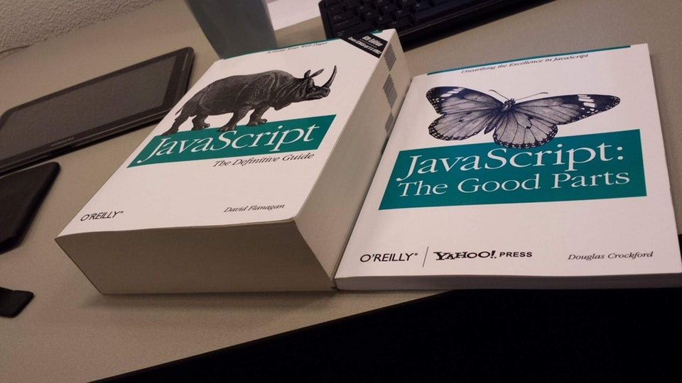
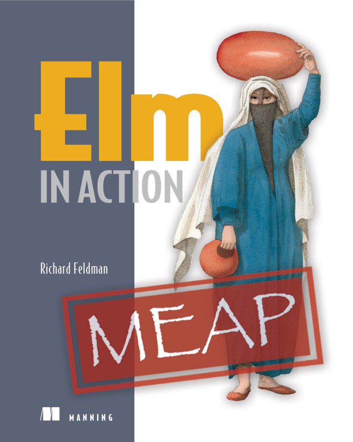

footer: [github.com/**DillonKearns**/talks](http://github.com/dillonkearns/talks) @dillontkearns
build-lists: true

# Introducing Elm at a Fortune 10 Company

## [github.com/**DillonKearns**](http://github.com/dillonkearns)

## [incrementalelm.com](http://incrementalelm.com)

---

# **Concerns**

- Internal experts
- Learning resources (internal & external)
- Knowledge transfer

---

# **Our Angular Experience**

**Internal Experts**

- Experts _weren't_ experts
- Senior devs > 1 year of Angular
  - Regularly making basic mistakes
  - _Wiring_ parameters to components 🤔
  - Test _mock_ setup (false positives/negatives) 🤔
  - _Extracting_ components..... 🤔🤔🤔

---

# **Our Elm Experience**

**Internal Experts**

- Beginners are _confident_ like experts
- Beginners _extract views_ like experts
- Beginners _write tests_ like experts
- Beginners _write code_ like experts

---

# **Our Angular Experience**

**Learning Resources**

- JavaScript & Angular learning wasn't sticky
- Remember what _not_ to do
- Silent errors
- Subtle data-binding bugs which unit tests didn't reveal
- Don't know if it works until you deeply inspect something

---

---

# **Our Elm Experience**

**Learning Resources**

- Elm has a tiny set of powerful, cohesive language features
- Language features get smaller over time, not larger
- If it's possible, it's not a hack
- If it's idiomatic, it's safe

---

# **Our Angular Experience**

**Knowledge Transfer**

- Changing the app required rewriting everything we touched
- Change the DOM from within an Angular component
- Plain JS, no type-safety
- Global variables
- Had to learn what not to touch in the app

---

# **Our Elm Experience**

**Knowledge Transfer**

- New team members could contribute without fear on day 1
- New team members were productive after 3 weeks
- New team members learn Elm instead of caveats in our codebase

---

# **Why We Love Elm**

---

# **Extracting Components**

- No components in Elm
- Stateless view helper functions
- Wiring is right OR it doesn't compile

---

# **Make Impossible States Impossible**

---

# **No Runtime Errors**

---

# Thank You!

### [github.com/**DillonKearns**](http://github.com/dillonkearns)

### [incrementalelm.com](http://incrementalelm.com)

