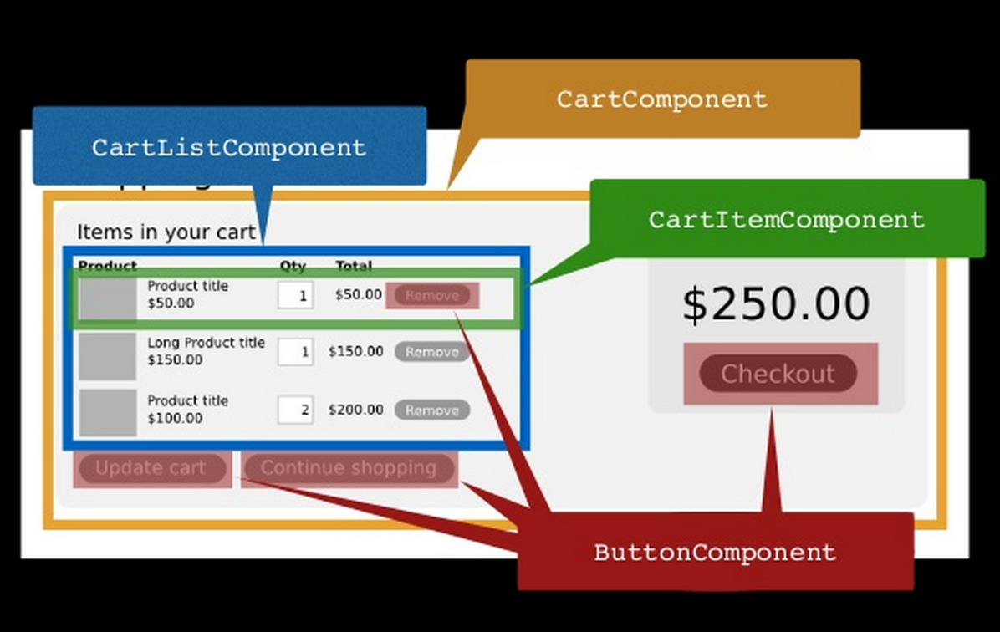

footer: [github.com/**DillonKearns**/talks](http://github.com/dillonkearns/talks) @dillontkearns
build-lists: true

# Introducing Elm at a Fortune 10 Company

## [github.com/**DillonKearns**](http://github.com/dillonkearns)

## [incrementalelm.com](http://incrementalelm.com)


---

# **Elm** 

- Language for client-side web apps
- Compiles to JavaScript
- Unlike TypeScript, ES2015, PureScript, etc., Elm lives in a sandbox
- Elm can call JavaScript, but not directly
- Like Haskell (much more approachable)
- Language choices favor
 simplicity
- Explicit over terse
- No runtime errors


---

# **Concerns**

- Internal experts
- Learning resources (internal & external)
- Knowledge transfer

---

# **Our Angular Experience**

**Internal Experts**

- Senior devs > 1 year of Angular
  - Regularly making basic mistakes
  - _Wiring_ parameters to components 🤔
  - Test _mock_ setup (false positives/negatives) 🤔
  - _Extracting_ components..... 🤔🤔🤔
- Experts _weren't_ experts

---

# **Our Elm Experience**

**Internal Experts**

- Beginners are _confident_ like experts
- Beginners _extract views_ like experts
- Beginners _write tests_ like experts
- Beginners _write code_ like experts

---

# **Our Angular Experience**

**Learning Resources**

- JavaScript & Angular learning wasn't sticky
- Remember what _not_ to do
- Silent errors
- Subtle data-binding bugs which unit tests didn't reveal
- Don't know if it works until you deeply inspect something

---


---

# **Our Elm Experience**

**Learning Resources**

- Elm has a tiny set of powerful, cohesive language features
- Language features get smaller over time, not larger
- If it's possible, it's not a hack
- If it's idiomatic, it's safe

---

# **Our Angular Experience**

**Knowledge Transfer**

- Changing the app required rewriting everything we touched
- Change the DOM from within an Angular component
- Plain JS, no type-safety
- Global variables
- Had to learn what not to touch in the app

---

# **Our Elm Experience**

**Knowledge Transfer**

- New team members could contribute without fear on day 1
- New team members were productive after 3 weeks
- New team members learn Elm instead of caveats in our codebase

---

# **Introducing Elm**

- Lunch and learn
- Seems interesting!
- Elm Katas
- People like it, do more
- Let's try using it!

---


---

# **Incremental Transition**

- Find a simple view in an area where we'll be doing feature work
- Dumb table in Elm (data from Angular)
- Fully wire it into our deploy pipeline
- Ship it to production! 🚢 🎉
- Do we like it? Let's do more
- Fetch its own data
- Page except navbar in Elm

---

# **Why We Love Elm**


---

# **Extracting Components**

- No components in Elm
- Stateless view helper functions
- Wiring is right OR it doesn't compile



---

# **Make Impossible States Impossible**

---

# **Domain Modeling**

- [Make Impossible States Impossible](https://www.youtube.com/watch?v=IcgmSRJHu_8)
- Contract-Driven Design
- More compiler guarantees =>
  More focused tests & fewer bugs


---

# **Domain Modeling**

```elm, [.highlight: 1]
contracts -- decoders
impossibleStates -- union types
```

- Without contracts, errors creep deep into the system
  => harder to trace
- Untyped => Typed
- No exceptions, errors are just data
- Annoyance at first, can't live without it once you get used to it

---

# **Decoding JSON**

`````javascript
{ "first": "Beverly", "last": "Crusher" }
```

### Discover contract violations at the gate

```elm
decodeString (field "middle" string) json
-- =>
Err "Expecting an object with a field named `middle` but instead got: ..."
```

---

# **Decoding JSON**

````javascript
{ "first": "Beverly", "last": "Crusher" }
```

...

```elm
Decode.decodeString (Decode.field "first" Decode.string) json
-- =>
Ok "Beverly"
`````

---

# **Data Modeling Example**

JavaScript

```javascript
{
    hasError: true,
    errorMessage : 'Error message from server',
    doneLoading: true,
    data: null
}
```

---

.pdf)

---

# Elm Data Modeling

```elm
type RemoteData data  -- we're defining a union type
    = NotAsked
    | Loading
    | Failure Http.Error
    | Success data
```

#### Constructing Union Types

```elm
Success { first = "James", last = "Kirk" }
Failure Http.Timeout
Loading
```

---

[krisajenkins/remotedata](http://package.elm-lang.org/packages/krisajenkins/remotedata/latest)

---

# **The Elm Architecture**

---

# **No Runtime Errors**

---


---

# Thank You!

### [github.com/**DillonKearns**](http://github.com/dillonkearns)

### [incrementalelm.com](http://incrementalelm.com)


