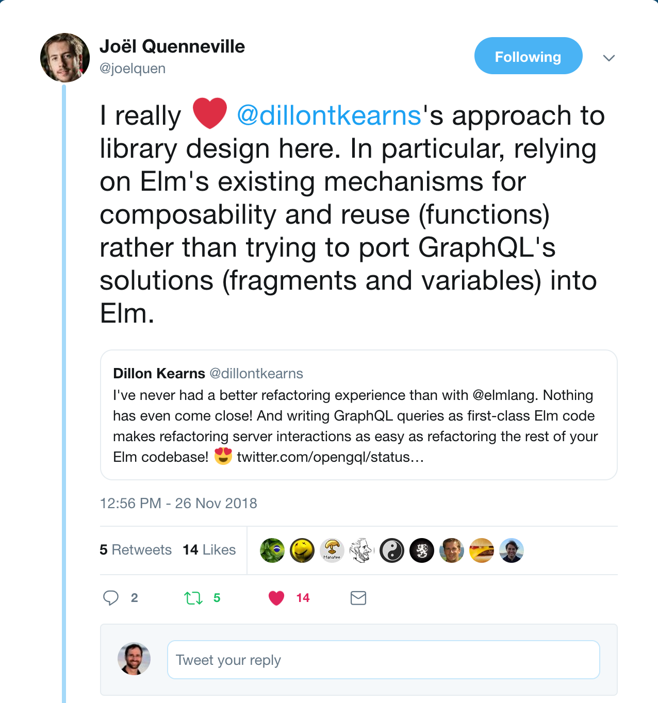
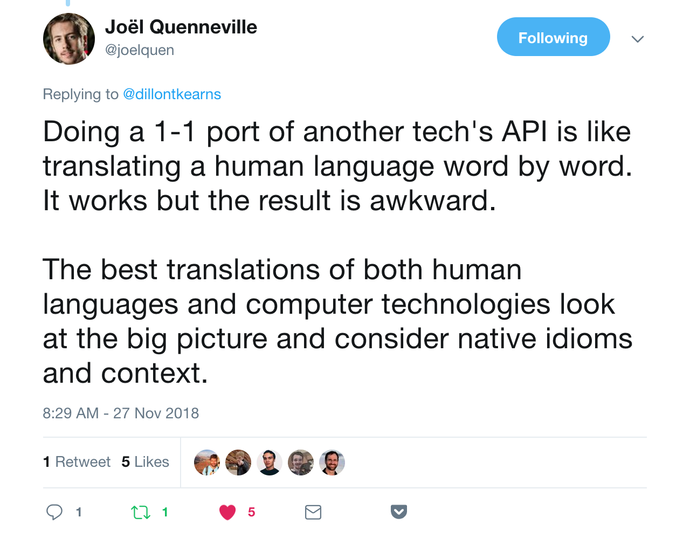
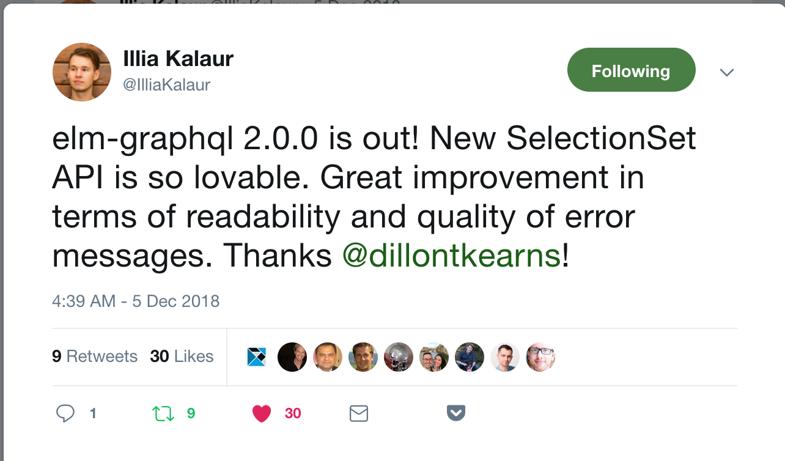

build-lists: true
slide-dividers: #

#

[.hide-footer]


# Order Matters

- Unit Testing
- Test-Driven Development (Test-First)
  - Decouples design
  - No false positives
  - Everything is covered by a test
  - Iterate with the help of tests
  - Code quality improves

^ - Fundamental difference from afterthought

# Lessons

- Problem-First (Outcome-Driven)
- Vision-First
- Example-First
- Approval-Tests-First
- Problem => Vision => Examples => Tests => Features

^ - Build it into process

# The Timeline

1. How Do I GraphQL in Elm? 🤷
1. Survey Tools
1. Vision
1. Working Example (No Code Gen)
1. End-To-End Tests & Code Gen
1. Hash-based aliases
1. Eliminate `Field`s

# 1. How Do I GraphQL in Elm? 🤷

[Mobster download page](http://mobster.cc/)

# [The Query](https://developer.github.com/v4/explorer/?query=query%20%7B%0A%20%20repository%28owner%3A%20%22dillonkearns%22%2C%20name%3A%20%22mobster%22%29%20%7B%0A%20%20%20%20stargazers%20%7B%0A%20%20%20%20%20%20totalCount%0A%20%20%20%20%7D%0A%20%20%7D%0A%7D%0A)

```elm
query {
  repository(owner: "dillonkearns", name: "mobster") {
    stargazers {
      totalCount
    }
  }
}
```

# [Full Query](https://developer.github.com/v4/explorer/?query=%7B%0A%20%20repository%28owner%3A%20%22dillonkearns%22%2C%20name%3A%20%22mobster%22%29%20%7B%0A%20%20%20%20stargazers%20%7B%0A%20%20%20%20%20%20totalCount%0A%20%20%20%20%7D%0A%20%20%20%20releases%28last%3A%201%29%20%7B%0A%20%20%20%20%20%20nodes%20%7B%0A%20%20%20%20%20%20%20%20releaseAssets%28last%3A%2030%29%20%7B%0A%20%20%20%20%20%20%20%20%20%20edges%20%7B%0A%20%20%20%20%20%20%20%20%20%20%20%20node%20%7B%0A%20%20%20%20%20%20%20%20%20%20%20%20%20%20downloadUrl%0A%20%20%20%20%20%20%20%20%20%20%20%20%20%20name%0A%20%20%20%20%20%20%20%20%20%20%20%20%20%20downloadCount%0A%20%20%20%20%20%20%20%20%20%20%20%20%7D%0A%20%20%20%20%20%20%20%20%20%20%7D%0A%20%20%20%20%20%20%20%20%7D%0A%20%20%20%20%20%20%7D%0A%20%20%20%20%7D%0A%20%20%7D%0A%7D%0A)

```elm
{
  repository(owner: "dillonkearns", name: "mobster") {
    stargazers {
      totalCount
    }
    releases(last: 1) {
      nodes {
        releaseAssets(last: 30) {
          edges {
            node {
              downloadUrl
              name
              downloadCount
            }
          }
        }
      }
    }
  }
}
```

# [Tried An Elm Client](https://github.com/dillonkearns/mobster/blob/2ad66f514579a09a9679b75b6c1b2956e7879b46/web/src/GithubGraphql.elm)

- Abandoned the attempt
- Too many domain concepts:

  ```elm
  ValueSpec NonNull ObjectType StarGazerCount ()
  ```

- No guardrails
- Ended up using a [plain HTTP Request & JSON Decoder](https://github.com/dillonkearns/mobster/blob/2ad66f514579a09a9679b75b6c1b2956e7879b46/web/src/Github.elm)

^ - Needed to run, check, run, check.

^ - Used regular Http request

^ - Copy-paste query that I knew worked

# 2. Survey Tools

- Build up Json Decoders and `gql` query together
  - Manual process, error-prone
- `gql` => Elm
  - No Elm 0.18 support
- GraphQL Schema => Elm API
  - My hypothesis

# 3. Vision

- Typed responses
- Impossible to write an incorrect query

^ - Started with my itch

^ - Wanted guardrails

# 3. Vision (Refined)

- Elm gives me clear feedback
- Elm (not `gql`) is 1st-class
- Meaningful data structures

^ - Didn't even know if it was possible

^ - Picked a clear strategy with confidence.

^ - Queries aren't the first-class citizen

^ - CODE is!

^ - Code changes, code is reused, code is refactored.

# Lesson

- Start with a hypothesis
- Clear, focused vision
- It can change over time, but it should always be narrow and clearly defined

^ It's okay for hypothesis to be invalidated.

# -



# -



# 3. [Explicit Vision](https://github.com/dillonkearns/elm-graphql)

- Users can evaluate whether it fits their needs
- [Communicate with values at the core](https://github.com/dillonkearns/elm-graphql/issues/27#issuecomment-361008781)
  - Creates empathy
  - Argue about preferred strategies vs.
  - Collaborate to achieve shared goal

^ - Easy to respond

^ - Not personal

^ - Invites alternatives

# User Feedback

1. **_Feedback_** from a **_user_**
   - "I like your hat!"
2. Feedback from a user **_about your product_**
   - "When you build this feature, make sure it's really fast!"
3. Feedback from a user about **_about their experience_** with your product
   - I was confused searching for recent blog posts about

^ - User testing

^ - Talk to the person with need, let their needs guide the design

# User Feedback

1. **_Feedback_** from a **_user_**
2. Feedback from a user **_about your product_**
3. Feedback from a user about **_about their experience_** with your product

- 3 => _Problem-First_ User Feedback

- Like legal concept: "Standing"

- 2 is the norm

- Ask questions to get to 3

# 4. Working Example [From Day 1](https://github.com/dillonkearns/elm-graphql/blob/56495760aabc7dd4944cfaebe998271b38eaca66/tests/Tests.elm)

```elm
type alias Human =
    { name : String }

query : Field.FieldDecoder Human
query =
    Human.human Human { id = "1000" } []
        |> Field.with Human.name
```

# 4. Working Test [From Day 1](https://github.com/dillonkearns/elm-graphql/blob/56495760aabc7dd4944cfaebe998271b38eaca66/tests/Tests.elm)

```elm
test "generate query document" <| \_ ->
  Field.fieldDecoderToQuery query
    |> Expect.equal
      """{ human(id: "1000") { name } }"""
```

[Commits](https://github.com/dillonkearns/elm-graphql/commits/bc12334291dc68d786da1206c4d9a8569dce8a49)

# 4. Working Test [From Day 1](https://github.com/dillonkearns/elm-graphql/blob/56495760aabc7dd4944cfaebe998271b38eaca66/tests/Tests.elm)

```elm
test "decodes properly" <| \() ->
  """{ "data": { "human": { "name": "Luke Skywalker" } } }"""
  |> Json.Decode.decodeString (Field.decoder query)
  |> Expect.equal (Ok { name = "Luke Skywalker" })
```

# 5. What Are Approval Tests?

- AKA "Gold Master"
- Fail if diff
- Fix code to make it green
- Or accept patch

# 5. Approval Test Scripts

- [Initial script](https://github.com/dillonkearns/elm-graphql/commit/d4799c44e9c63ad2c82d0e5369be4766db8d7978) - very early
- [Mature script](https://github.com/dillonkearns/elm-graphql/blob/master/bin/approve)
- Demo

# Examples Versus Tests

- Unit tests at first
- Still meaningful from the start
- [Evolved to examples folder (which _is_ the approval test suite)](https://github.com/dillonkearns/elm-graphql/commit/c3d1cda62adbabb7fae9fc5535c28a9052cca989#diff-2d5fe20321b71db836c3b16a8828d630)
- Evaluate the design with zero friction
- [Upgrade guide is free!](https://github.com/dillonkearns/elm-graphql/blob/master/CHANGELOG-ELM-PACKAGE.md#150---2018-11-27)

^ - Avoid toy examples

# 6. Hash-Based Aliases

- Started from [user feedback](https://github.com/dillonkearns/elm-graphql/issues/64)
- First focus on solving it with existing API
- Solved a problem, but opened up possibilities
- Based on user feedback
- [Blog post](https://medium.com/@dillonkearns/how-elm-guides-towards-simplicity-3d34685dc33c)

^ Removed domain concept: Fields

# 6. [Hash-Based Alias Solution](https://github.com/dillonkearns/elm-graphql/issues/64#issuecomment-435733851)

```haskell
query {
  human(id: "1001") { name }
  human1: human(id: "1004") { name }
  human2: human(id: "1004") { id }
}
```

Versus

```haskell
query {
  human1213318493: human(id: "1001") { name }
  human3685532794: human(id: "1004") { name }
  human3685532794: human(id: "1004") { id }
}
```

^ Less imperative

# Lesson

- Outcome-driven user feedback

- Example-first

  - Make one use-case awesome

  - Then make another use case awesome!

  - Iterate, don't solve it all at once

^ - Trying to do everything, you might do everything, but it won't be awesome

^ - Why? Evolution of the design, allows you to see simplifications.

# 7. [Eliminate `Field`s](https://github.com/dillonkearns/elm-graphql/pull/96/files#diff-a7a8067991f96a0cd74633c0fc477539R42)



# Event: Exhaustive Types

- Wouldn't be possible without query-builder approach...
- Or at least it would be awkward. Your code would suddenly go from returning a `String` to a `Maybe String`

# Idiomatic Elm Package Guide

https://github.com/dillonkearns/idiomatic-elm-package-guide

# Intro to `elm-graphql`

```elm
query {
  human(id: "1001") {
    name
    homePlanet
  }
}
```

#### [`Run query`]((http://elm-graphql.herokuapp.com/?query=query%20%7B%0A%20%20human(id%3A%20%221001%22\)%7B%0A%20%20%20%20name%0A%20%20%20%20homePlanet%0A%20%20%7D%0A%7D%0A)

# Intro to `elm-graphql`

```elm
query : SelectionSet (Maybe Human) RootQuery
query =
    Query.human { id = Id "1001" } humanSelection

type alias Human =
    { name : String
    , homePlanet : Maybe String
    }

humanSelection : SelectionSet Human StarWars.Object.Human
humanSelection =
    SelectionSet.map2 Human
        Human.name
        Human.homePlanet
```
