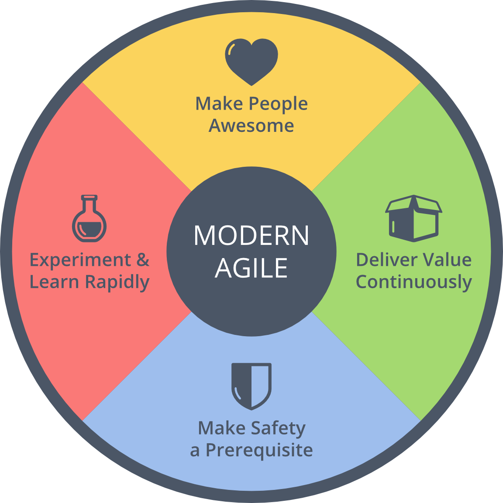
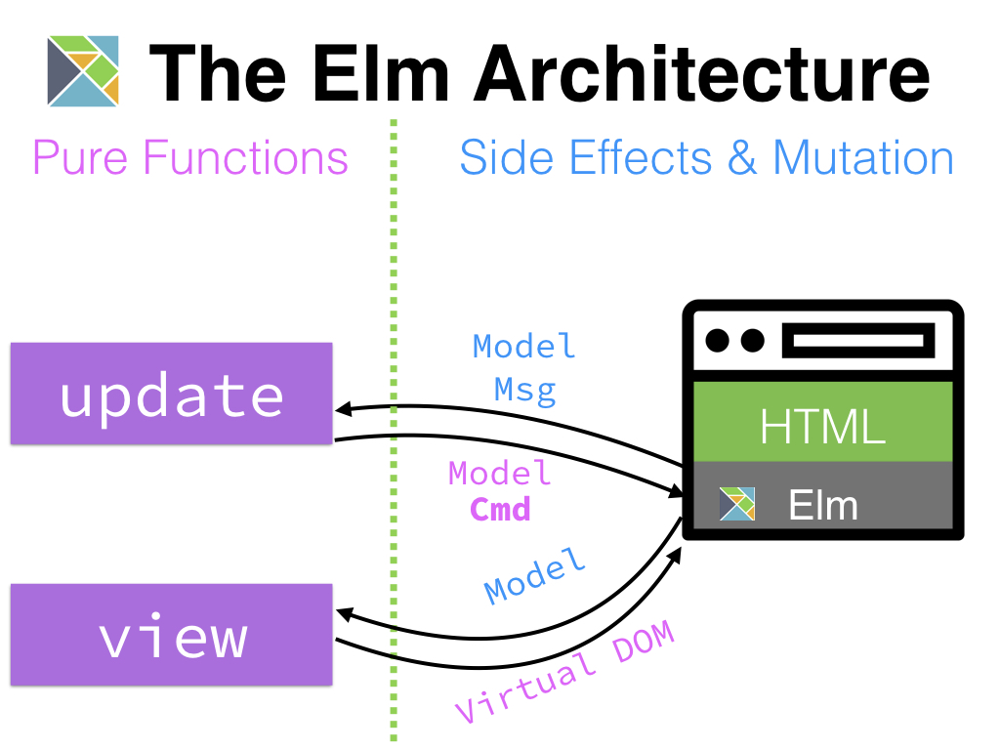
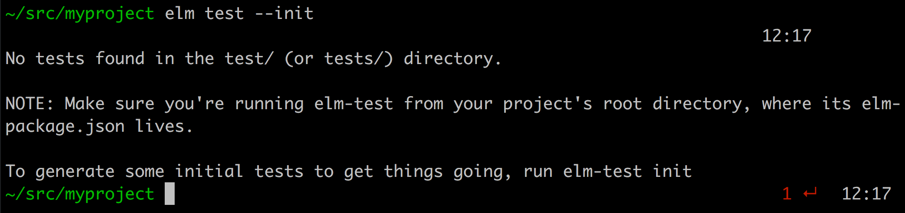

footer: [github.com/**DillonKearns**/talks](http://github.com/dillonkearns/talks) @dillontkearns
build-lists: true

# Developing For The Web With Extreme Safety

^ Elm has language features that support safety
Also has ethos that promotes safety
Lots of innovation inspired by features & ethos

## [github.com/**DillonKearns**](http://github.com/dillonkearns)


---




---

# **Safety Tips**

1. Traceability
1. Domain Modeling
1. Consumer-Driven APIs


---

# **Elm** 

* Language for client-side web apps
* Compiles to JavaScript
* Unlike TypeScript, ES2015, PureScript, etc., Elm lives in a sandbox
* Elm can call JavaScript, but not directly
* Based on Haskell
* Language choices favor
 simplicity
* Explicit over terse
* No runtime errors


---

# 1) **Traceability**

* Uncertainty as data
* Managed effects


---

# 1) **Traceability**

```elm, [.highlight: 1]
uncertaintyAsData -- How do you deal with uncertainty?
managedEffects
```

* No null, Maybe union instead

---

# **Uncertainty as Data**

### The `Maybe` type

```elm
type Maybe value
  = Just value
  | Nothing
```

#### Examples

```elm
List.head [100, 200, 300] == Just 100

List.head [] == Nothing
```

---

# 1) **Traceability**

```elm, [.highlight: 1]
uncertaintyAsData -- How do you deal with uncertainty?
managedEffects
```

* Can't raise exceptions
* No global exception handlers squelching errors
* No propagating hard-to-debug nulls from exception handlers
* Errors are traceable
* Exceptions are like `GOTO`s
* ...Except the destination line is determined by outside context
* `goto ???`

---

# **Uncertainty as Data**

### The `Result` type

```elm
type Result data error
  = Ok data
  | Err error
```

#### Examples

```elm
String.toInt "-42" == Ok -42
String.toInt "3.1" == Err "could not convert string '3.1' to an Int"
```

---

# Dealing With Uncertainty

```elm
parseIntOrNegativeOne intString =
  let
    toIntResult =
      String.toInt intString
  in
  case toIntResult of
    Ok intValue ->
      intValue
    Err errorMessage ->
      -1
```

### `case` can also be written as

```elm
Result.withDefault -1 result
```

---

# 1) **Traceability**

```elm, [.highlight: 2]
uncertaintyAsData
managedEffects
```

* Funnel all side-effects to one place
* Single place where non-determinism/side effects stem from
* Single place where the results of non-determinism/side-effects funnels into

---



---

# 2) **Domain Modeling**

* [Make Impossible States Impossible](https://www.youtube.com/watch?v=IcgmSRJHu_8)
* Contract-Driven Design
* More compiler guarantees =>
  More focused tests & fewer bugs


---

# 2) **Domain Modeling**

```elm, [.highlight: 1]
contracts -- decoders
impossibleStates -- union types
```

* Without contracts, errors creep deep into the system
  => harder to trace
* Untyped => Typed
* No exceptions, errors are just data
* Annoyance at first, can't live without it once you get used to it

---

# **Decoding JSON**

```elm
  json = """{ "first": "Beverly", "last": "Crusher" }"""

  decodeString (field "first" string) json
    == Ok "Beverly"
```

---

```elm
  json = """{ "first": "Beverly", "last": "Crusher" }"""

  Decode.decodeString (Decode.field "name" Decode.string) json
  -- =>
  Err "Expecting an object with a field named `name` but instead got: ..."
```

---

# **Data Modeling Example**

JavaScript

```javascript
{
    hasError: true,
    errorMessage : 'Error message from server',
    doneLoading: true,
    data: null
}
```

---

.pdf)

---

# Elm Data Modeling

```elm
type RemoteData data  -- we're defining a union type
    = NotAsked
    | Loading
    | Failure Http.Error
    | Success data
```

#### Constructing Union Types

```elm
Success { first = "James", last = "Kirk" }
Failure Http.Timeout
Loading
```

---

[krisajenkins/remotedata](http://package.elm-lang.org/packages/krisajenkins/remotedata/latest)

---

# 3) **Consumer-Driven APIs**

### What does UX for APIs have to do with safety?

* Guide towards correct use
* Minimal interface
* Trying to support everything is a hazard
* Start opinionated, minimal
* Introduce flexibility as needed


---

# Misleading Error



---

```javascript, [.highlight: 17]
var args = minimist(process.argv.slice(2), {
  alias: {
    help: "h",
    fuzz: "f",
    seed: "s",
    compiler: "c",
    "add-dependencies": "a",
    report: "r",
    watch: "w"
  },
  boolean: ["warn", "version", "help", "watch"],
  string: ["add-dependencies", "compiler", "seed", "report", "fuzz"]
});
function runElmTest() {
  checkNodeVersion();

  if (args._[0] == "init") {
    var cmdArgs = Init.init();
    var cmd = [pathToElmPackage, "install", "--yes"].concat(cmdArgs).join(" ");

    child_process.execSync(cmd, { stdio: "inherit", cwd: Init.elmPackageDir });

    process.exit(0);
  }
```

[Github source](https://github.com/rtfeldman/node-test-runner/blob/4f9147f687e5636e0c2fd0b661ab5262c9e90faf/lib/elm-test.js#L287)

---

# **Enforce Contracts at the Gate**

## Imperative vs. Declarative

---

# **Contracts & GraphQL**

```elm
{
  human(id: "1000") {
    name
    height
  }
}
```

---

```elm, [.highlight: 1]
minimizeConstructs -- Graphqelm Constructs
otherThing
```

### Aliases & Fragments

```elm
{
  leftComparison: hero(episode: EMPIRE) {
    ...comparisonFields
  }
  rightComparison: hero(episode: JEDI) {
    ...comparisonFields
  }
}

fragment comparisonFields on Character {
  name
  appearsIn
  friends {
    name
  }
}
```

---

# **Minimize Constructs**

## Variables

```elm
query HeroName($episode: Episode) {
  hero(episode: $episode) {
    name
  }
}
```

---

Instead of checking if certain things are present and letting uncertainty slip through,
catch contract violations at the gate and don't let them through.
