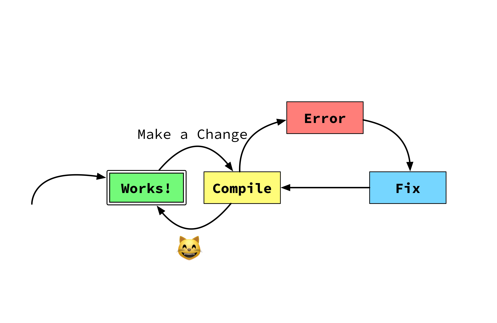
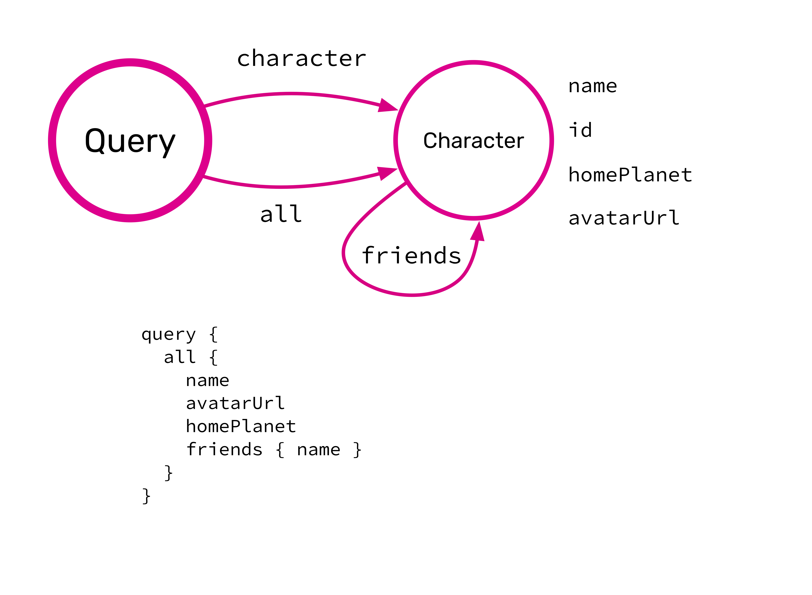

footer: bit.ly/**typeswithoutborders**
build-lists: true
slide-dividers: #

#

[.hide-footer]


#  JavaScript

```javascript
let json = Json.parse(stringFromServer);
```

- _`Json is not defined`_

- Don't know until runtime.

[.text-emphasis: #FF4909, text-scale(1.6), Avenir Next Regular]

[.text-strong: #0096FF, text-scale(1.5), Avenir Next Regular]

# -


^ Run app to know things?

#  Elm Compiler

- Knows a lot!
- Make impossible states impossible
- If it compiles it works! ™

^ Elm is one solution.

#  Custom `Msg` Types

```elm
type Msg
  = Increment


update msg model =
  case msg of
    Increment ->
      (model + 1, Cmd.none)
```

#  Add to `Msg`

```elm
type Msg
  = Increment
  | Decrement

update msg model =
  case msg of
    Increment ->
      (model + 1, Cmd.none)
```

- This `case` does not have branches for all possibilities...

#  Single Source of Truth

```elm
type Msg
  = Increment
  | Decrement

update msg model =
  case msg of
    Increment ->
      (model + 1, Cmd.none)

    Decrement ->
      (model - 1, Cmd.none)
```

^ If it compiles it works.

# -


^ Compiler knows everything!
Happy place!

#  APIs in Elm

[.code-highlight: 1-3]

[.code-highlight: 1-5]

[.code-highlight: 1-7]

[.code-highlight: 1-9]

[.code-highlight: 1-12]

[.code-highlight: 1-13]

```elm
type Character
    = Human { name : String, homePlanet : String }
    | Droid { name : String, primaryFunction : String }

decoder : Decode.Decoder Character
decoder =
    Decode.field "type" Decode.string
        |> Decode.andThen
            (\characterType ->
                case characterType of
                    "human" -> humanDecoder
                    "droid" -> droidDecoder
                    _ -> Decode.fail "Invalid Character")
```

^ Check assumptions at gate.
Still, duplicate contract.

#  Nested Decoders

```elm
humanDecoder : Decode.Decoder Character
humanDecoder =
    Decode.map2 HumanAttributes
        (Decode.field "name" Decode.string)
        (Decode.field "homePlanet" Decode.string)
        |> Decode.map Human


droidDecoder : Decode.Decoder Character
droidDecoder =
    Decode.map2 DroidAttributes
        (Decode.field "name" Decode.string)
        (Decode.field "primaryFunction" Decode.string)
        |> Decode.map Droid
```

^ Tedious.
More important:
No guarantees.

#  `BadPayload`

## [fit] Expecting an object with a field named `name` but instead got...

^ Validate assumptions immediately 👍
Represent uncertainty 👍

<!-- [.text: #FF2600, text-scale(1.5), Avenir Next Regular] -->

# -


^ Thought we were past this...

#  Implicit Assumptions

```javascript
greet(jsonResponse.name);
```

- `"Hello [object Object]!"`
- Explicit assumptions are nice (e.g. `Result`)
- No assumptions is best

^ Explicit is better.
Still assumptions.

# When Can I Know?


# When Can I Know?


^ Implicit assumptions flow deep.
Get more compiler guarantees somehow...

# [fit] Uncertainty

[.footer-style: alignment(right), text-scale(1.5), Avenir Next Regular]

<br />


# [fit] Uncertainty

[.footer-style: alignment(right), text-scale(1.5), Avenir Next Regular]

<br />

### [fit] 1. Unavoidable


# [fit] Uncertainty

[.footer-style: alignment(right), text-scale(1.5), Avenir Next Regular]

<br />

### [fit] 1. Unavoidable

### [fit] 2. Avoidable


# Unavoidable Uncertainty

```elm, [.highlight: 1-4]
type Error
    = BadStatus (Response String)
    | Timeout
    | NetworkError
```

- Can't guarantee WiFi 
- Representing unavoidable uncertainty 👍

^ Can't guarantee wifi
Representing unavoidable 👍

# Avoidable Uncertainty

```elm, [.highlight: 5]
type Error
    = BadStatus (Response String)
    | Timeout
    | NetworkError
    | BadUrl String
```

- Could make this impossible.

^ Not talking about that!
Let's focus on #TypesWithoutBorders

# Avoidable Uncertainty

```elm, [.highlight: 6]
type Error
    = BadStatus (Response String)
    | Timeout
    | NetworkError
    | BadUrl String
    | BadPayload String (Response String)
```

- Two sources of truth

^ Assumptions about the response.

# Avoidable Uncertainty


^ Not what we signed up for!

# With Certainty



^ Still run
But with more guarantees

# Single Source of Truth

```elm
type Msg
  = Increment
  | Decrement

update msg model =
  case msg of
    Increment ->
      (model + 1, Cmd.none)

    -- You forgot a case!
```

^ Single source.
Certainty!

# -


# -


# -


# -


# -


#  GraphQL

- Strong guarantees
- Enforces contract
- Robust type system

#  GraphQL Enums

```haskell
enum SortOrder {
  ASCENDING
  DESCENDING
}
```

#  GraphQL Objects

```haskell
type Character {
  name: String!
  homePlanet: String
  avatarUrl: String!
  friends: [Character!]!
}
```

^ Represent nullability.

#  GraphQL Arguments

```haskell
type Query {
  character(id: ID!): Character
  all: [Character!]!
}
```

^ May not find ID.

# -


# -



# -


# -


# `dillonkearns/elm-graphql`

- Generates a "hardcoded library"
- `Json.Decode` is an implementation detail

# `dillonkearns/elm-graphql` Guarantees

- Correct request
- Well-typed
- Decodes correctly

# `Json.Decode.Pipeline`

```elm
type alias CharacterInfo =
  { name : String
  , avatarUrl : String
  , homePlanet : Maybe String
  }

characterDecoder =
  Decode.succeed CharacterInfo
    |> required "name" string
    |> required "avatarUrl" string
    |> optional "homePlanet" (nullable string)
```

^ Looks similar to `Json.Decode.Pipeline`

# `dillonkearns/elm-graphql`

```elm
type alias CharacterInfo =
  { name : String
  , avatarUrl : String
  , homePlanet : Maybe String
  }

characterSelection =
  Character.selection CharacterInfo
    |> with Character.name
    |> with Character.avatarUrl
    |> with Character.homePlanet
```

^ Defines a request.

# Demo!

## [fit] `dillonkearns/elm-graphql`


#  Breaking Change

```haskell
type Character {
  name: String!
  avatarUrl: String!
  homePlanet: String
}
```

#  Breaking Change

```haskell
type Character {
  name: String!
  -- avatarUrl: String!
  homePlanet: String
}
```

# -


# -


# -


# -


# -


# -


# -


# -


#  TypeScript

- Superset of JavaScript
- Editor integration, auto-complete
- Union Types
- Just add a `tsconfig.json`!

# `npm install @types/<npm-library>`

- Often included (`electron`, `moment`)

^ Show `moment`'s' `.d.ts` file.
^ Show generated code
Show that it knows the lookup results in `null | string`... it will be happy if we wrap it in an if. And then we can send it to the appropriate port.

# Why Not Functional Compile-to-JS?

 

- Avoid double-interop


# -


# -


# -


# Demo!

## `elm-typescript-interop`


# -


# -


# -


[.footer-style: #c0c0c0, alignment(right), text-scale(1.5), Avenir Next Regular]

[.text-strong: #ffffff, text-scale(1.5), Avenir Next Regular]

# Variable Contracts

- APIs
- Databases/Storage 
- Message Passing  
  <br />
- Any user-defined contract

^ Remove avoidable uncertainty.

# -


# -


# -


# -


# -


# -


^ Storage
Represent schema
Way to migrate from previous schema.

# Sharing About Code Generation

- Code generation is more tedious than difficult
- Blog posts, talks
- End-to-end testing techniques
- Extract libraries

# Representing Contracts in Elm

[.build-lists: false]

- [Advanced Types posts](https://medium.com/@ckoster22/advanced-types-in-elm-opaque-types-ec5ec3b84ed2) - Charlie Koster
  (Opaque Types, Phantom Types)
- [Making Impossible States Impossible](https://www.youtube.com/watch?v=IcgmSRJHu_8) - Richard
- [Make Data Structures](https://www.youtube.com/watch?v=x1FU3e0sT1I&list=PL-cYi7I913S-VgTSUKWhrUkReM_vMNQxG&index=11) - Richard
- [Scaling Elm Apps](https://www.youtube.com/watch?v=DoA4Txr4GUs) - Richard
- [Understanding Style](https://www.youtube.com/watch?v=NYb2GDWMIm0) - Matt Griffith

# -

[.background-color: #000000]


# Let's Eliminate Avoidable Uncertainty!


^ Not just model it!

# Let's Be Certain Early!


# Let's Be Certain Early!


# -

## [fit] #TypesWithoutBorders

What are your ideas?


[.text: #FF2600, text-scale(2), Avenir Next Regular]

[.header: #0a0a0a, text-scale(1.5), Fira Sans Bold]

[.footer-style: alignment(right), text-scale(1.5), Avenir Next Regular]

# -

[.hide-footer]


